# Ethereum (Tipo D) — Introduzione a Blockchain, Bitcoin ed Ethereum

> **Lezione n.** 2 | **Corso:** Crediti di introduzione e programmazione Smart Contracts per Ethereum (3 CFU Tipo D)

---

## Indice
- [[#1. Informazioni sul corso]]
- [[#2. Cos'è una Blockchain]]
- [[#3. Bitcoin]]
- [[#4. Ethereum]]
- [[#5. Proof of Stake in Ethereum]]
- [[#Appendice — Approfondimenti consigliati]]

---

## 1. Informazioni sul corso

- **Struttura:** 2 CFU lezioni frontali + 1 CFU project work
- **Esame:** sviluppo di un progetto (individuale o gruppi da 2-3 persone)
- **Valutazione:** i CFU tipo D non danno voto, vengono solo convalidati
- **Materiale:** slide su Moodle + libri *Mastering Ethereum* (2ª ed., disponibile su GitHub) e *Mastering Bitcoin* (O'Reilly)
- **Ricevimento:** via email, disponibile in presenza o Zoom

---

## 2. Cos'è una Blockchain

### 2.1 Il problema del registro distribuito

Immagina un consorzio di persone che si scambiano beni/servizi. Serve un **libro contabile** condiviso che registri ogni scambio (**transazione**). Il problema: a chi si affida il registro?

**Soluzione centralizzata:** un'entità terza di fiducia (notaio, banca, stato).
**Problema:** dipende dalla fiducia in quell'entità; è un punto unico di attacco/fallimento.

**Soluzione blockchain:** eliminare l'entità centrale → ognuno mantiene la propria copia del registro.

### 2.2 Principi fondamentali

| Proprietà | Descrizione |
|-----------|-------------|
| **Decentralizzazione** | Nessuna entità centrale; tutti i nodi sono pari |
| **Immutabilità** | Una volta scritto un blocco, non è modificabile senza riscrivere tutta la storia |
| **Trasparenza** | Tutte le transazioni sono pubblicamente verificabili |
| **Pseudo-anonimato** | Indirizzi pubblici ma non direttamente collegati a identità reali |

### 2.3 Consenso decentralizzato

Il problema fondamentale: come fare in modo che copie diverse del registro rimangano coerenti, senza un arbitro centrale?

> Il [[consenso-decentralizzato]] si basa su meccanismi **informatici + teoria dei giochi**: chi mente riceve una penalità economica superiore al beneficio → tutti hanno incentivo a comportarsi onestamente.

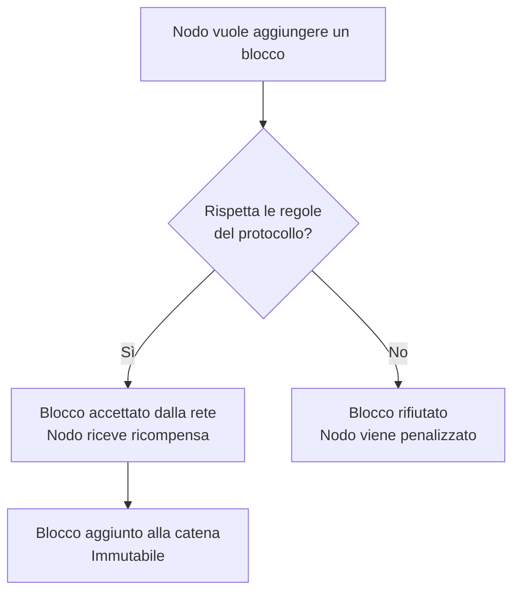

---

## 3. Bitcoin

### 3.1 Panoramica

- Lanciata nel **2009**, 16+ anni di funzionamento
- Prima implementazione di un sistema di consenso decentralizzato **peer-to-peer**
- Innovazione principale: risolvere il **double spending** senza entità centrale
- Rete resiliente: distribuita globalmente → impossibile chiuderla con un singolo attacco

### 3.2 Transazioni e modello UTXO

Una **transazione** in Bitcoin è una struttura dati che descrive il trasferimento di token da uno o più indirizzi sorgente a uno o più indirizzi destinazione.

Le transazioni sono raccolte in **blocchi** (pagine del libro contabile), i blocchi sono concatenati tra loro → **blockchain**.

Bitcoin è una **macchina a stati**:
- **Stato** = insieme degli [[utxo]] (Unspent Transaction Output): corrispondenza `{indirizzo → quantità token}`
- **Transizione di stato** = transazione che consuma UTXO esistenti e ne crea di nuovi

#### Modello UTXO

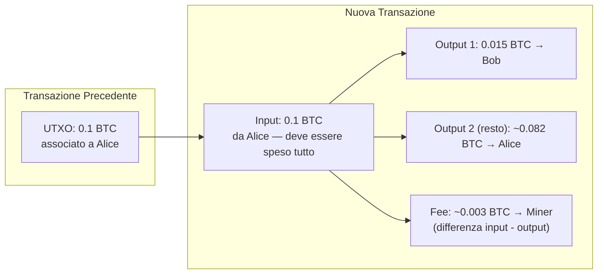

> **Attenzione:** ogni UTXO deve essere speso **interamente**. Il resto va esplicitamente re-inviato al proprio indirizzo; se non specificato, la differenza diventa interamente fee per il miner.

**Fee:** non dipendono dall'importo trasferito, ma dalla **complessità della transazione** (numero di input/output) e dalla **congestione della rete**.

### 3.3 Wallet, chiavi e indirizzi

Il **[[wallet]]** è un software che:
1. Gestisce le coppie di chiavi pubbliche/private
2. Costruisce, firma e trasmette le transazioni
3. Derivare i saldi interrogando la blockchain (i saldi NON sono memorizzati nel wallet)

#### Crittografia asimmetrica

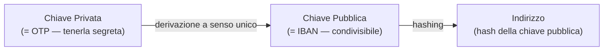

| Elemento | Analogia | Scopo |
|----------|---------|-------|
| **Chiave pubblica** | IBAN | Ricevere fondi; chiunque può mandarti token |
| **Chiave privata** | OTP bancario | Firmare transazioni; autorizzare movimenti |
| **Indirizzo** | Numero conto breve | Identità pubblica sulla blockchain |

> Una transazione firmata con la chiave privata può essere **verificata** da chiunque tramite la chiave pubblica, senza che la chiave privata sia mai esposta.

#### Generazione delle chiavi (wallet deterministico)

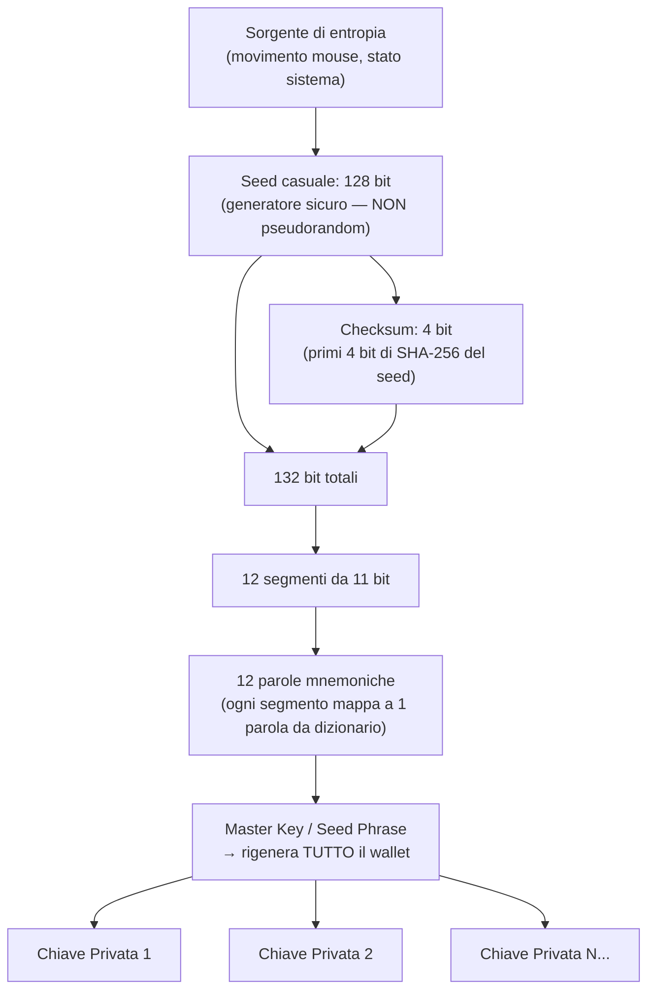

> **IMPORTANTE:** le 12 parole mnemoniche sono la chiave di tutto. Perderle = perdere i fondi permanentemente. Nessuna autorità centrale può recuperarle. Conservarle **su carta, scritte a mano, in un luogo fisico sicuro**.

#### Tipi di wallet

| Tipo | Storage chiavi | Sicurezza |
|------|---------------|-----------|
| **Web/Cloud** | Server terzi | Bassa — se il cloud viene compromesso, fondi a rischio |
| **Mobile** | Dispositivo | Media — dipende dalla sicurezza del telefono |
| **Desktop** | Computer locale | Media-alta — vulnerabile a malware |
| **Hardware wallet** | Dispositivo fisico dedicato | Alta — chiavi non lasciano mai il dispositivo |

#### Wallet deterministici vs non-deterministici

- **Non deterministico:** ogni chiave generata da un numero casuale indipendente → backup di N chiavi separati
- **Deterministico (BIP32):** tutte le chiavi generate da una singola master key → backup delle sole 12 parole

### 3.4 Ciclo di vita di una transazione Bitcoin

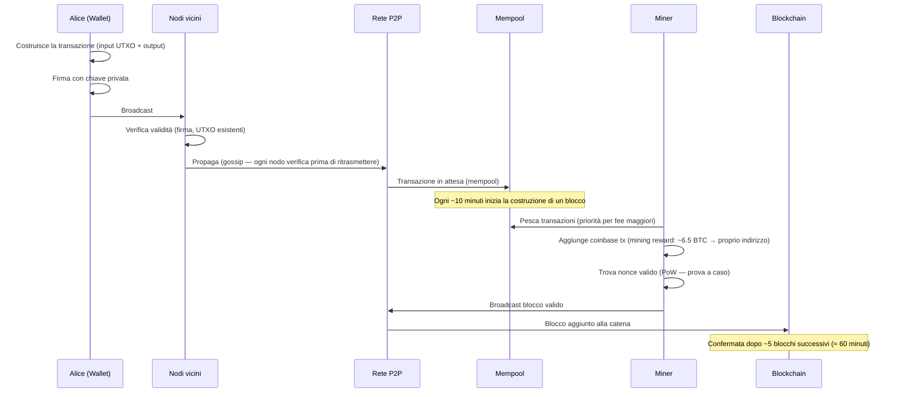

### 3.5 Mining e Proof of Work

**Funzioni di hash** proprietà fondamentali:
- Input qualsiasi → output di lunghezza fissa
- Piccola variazione dell'input → output completamente diverso
- **One-way:** impossibile ricavare l'input dall'output

**Il problema del mining:**
> Trovare un valore `nonce` tale che `hash(blocco || nonce)` inizi con N zeri.

Siccome la funzione di hash è one-way, l'unico metodo è **brute-force** (provare nonce a caso). Il numero di zeri richiesti è la **difficoltà**.

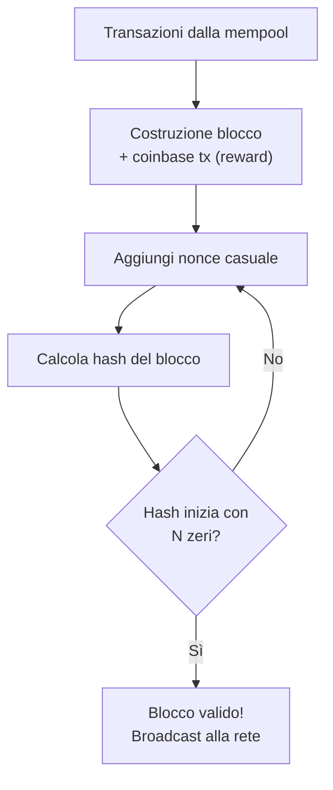

**Aggiustamento difficoltà:** se i blocchi vengono generati troppo velocemente, il protocollo aumenta automaticamente la difficoltà per mantenere l'intervallo a ~10 minuti.

**Halving:** il mining reward si dimezza ogni ~4 anni. Partito da 50 BTC, ora ~6.25 BTC.

### 3.6 Fork e risoluzione dei conflitti

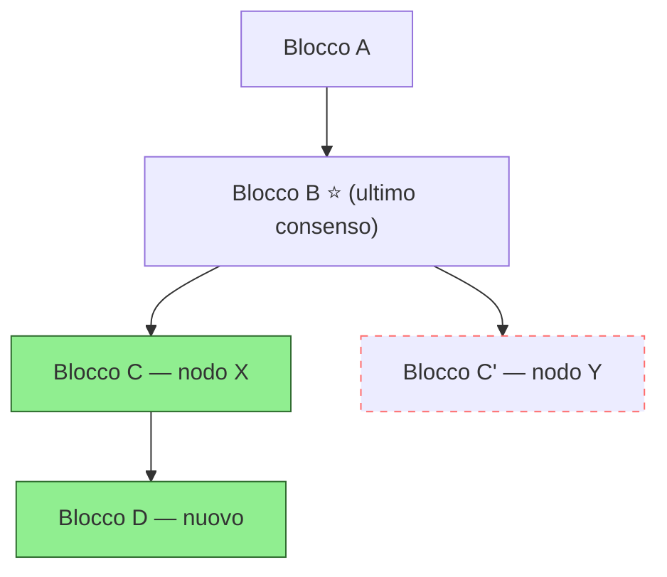

**Regola:** vince la **catena più lunga**. Quando un nodo vede una versione più lunga, la adotta e scarta la propria.

> Conseguenza: le transazioni nel blocco scartato (fork perso) vengono rimosse dalla blockchain. Per questo servono **N conferme** prima di considerare una transazione definitiva.

**In Bitcoin: ~5 blocchi ≈ 60 minuti** per la finalizzazione.

---

## 4. Ethereum

### 4.1 Introduzione e differenze da Bitcoin

**Ethereum** (2013/2015) introduce il concetto di **[[smart-contract]]**: programmi eseguibili all'interno della blockchain.

| Aspetto | Bitcoin | Ethereum |
|---------|---------|----------|
| Scopo principale | Trasferimento di valore | Piattaforma per applicazioni decentralizzate |
| Stato globale | `{indirizzo → quantità BTC}` | Memoria general-purpose `{chiave → valore}` |
| Linguaggio | Script (limitato) | Solidity (Turing-completo*) |
| Tempo di blocco | ~10 minuti | ~12 secondi (slot) |
| Finalizzazione | ~60 min (5 blocchi) | ~6 minuti (1 epoca) |

> **Ethereum = "The World Computer"**: esecuzione di programmi in un ambiente decentralizzato e replicato (NON distribuito — vedi nota sotto).

> ⚠️ Ethereum è un computer **replicato**, non distribuito. Ogni nodo riesegue tutti gli smart contract. Le performance sono limitate dal nodo più lento della rete. Non c'è parallelismo come in una server farm.

### 4.2 EVM — Ethereum Virtual Machine

Gli [[smart-contract]] vengono scritti in **[[solidity]]** (linguaggio ad alto livello), compilati in **bytecode** ed eseguiti sull'[[evm]].

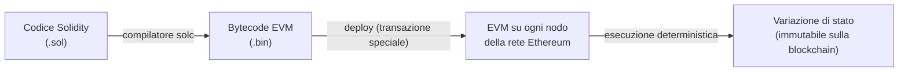

> L'EVM è **compatibile** con altre piattaforme: Binance Smart Chain, Polygon, ecc. → gli smart contract Ethereum funzionano anche su queste reti.

**Proprietà critiche:**
- **Immutabilità:** il codice pubblicato non può essere modificato. Un bug rimane nel contratto per sempre (si può pubblicare una versione nuova, ma quella vecchia resta).
- **Determinismo:** tutti i nodi devono arrivare allo stesso stato → nessuna operazione casuale o dipendente dal tempo.

### 4.3 Tipi di account in Ethereum

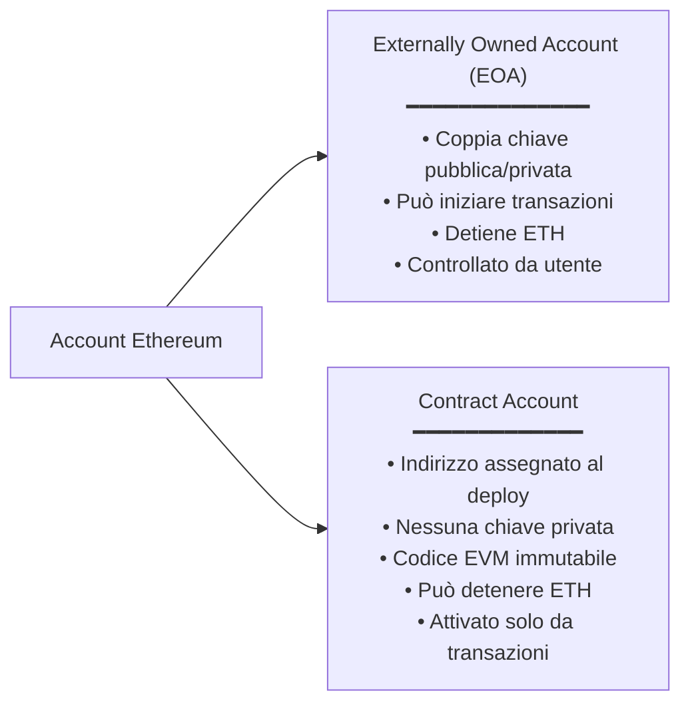

> Una transazione può **partire solo da un EOA** (perché deve essere firmata e pagare le fee). I contratti possono a loro volta chiamare altri contratti, generando catene di chiamate.

### 4.4 Transazioni in Ethereum

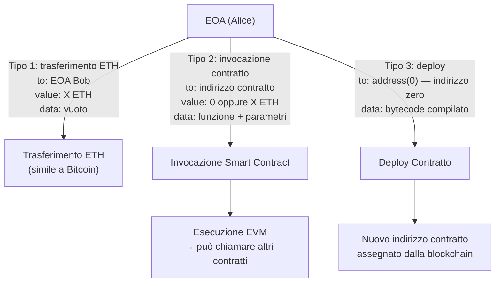

**Campi principali di una transazione Ethereum:**

| Campo | Descrizione |
|-------|-------------|
| `to` | Indirizzo destinatario (EOA o contratto; address(0) per deploy) |
| `value` | Quantità di ETH da trasferire (può essere 0) |
| `data` | Payload: bytecode (deploy) o selettore funzione + parametri (invocazione) |
| `nonce` | Numero sequenziale per ordinare le transazioni dello stesso EOA |
| `gasLimit` | Massimo gas che si è disposti a consumare |
| `maxFeePerGas` | Prezzo massimo per unità di gas |
| Firma | Derivata dalla chiave privata tramite crittografia a curva ellittica |

### 4.5 Gas — il carburante di Ethereum

Il [[gas-ethereum]] è un'unità di misura delle risorse computazionali. Ogni istruzione EVM ha un costo in gas.

**Perché il gas e non direttamente ETH?**
> Separare il prezzo delle risorse dalla volatilità speculativa dell'ETH. Il prezzo del gas dipende dalla congestione della rete, non dal mercato delle criptovalute.

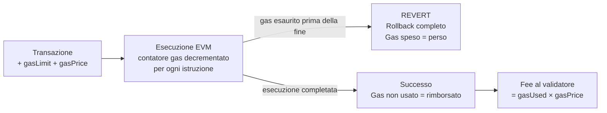

**Limite di gas per blocco:** esiste un limite massimo di gas consumabile in un singolo blocco → impedisce smart contract con loop infiniti o computazioni eccessive.

> **Implicazione pratica per lo sviluppo:** evitare iterazioni su strutture dati di dimensione variabile nello smart contract. Preferire:
> - Hash map / mappings con accesso O(1) tramite chiave
> - Ritornare liste raw e fare computazioni lato front-end (off-chain)

**Problema della terminazione:**
> Determinare esattamente quanto gas servirà è equivalente al problema della terminazione → impossibile nel caso generale. Bisogna stimare e settare un gasLimit conservativo.

### 4.6 Nonce — ordinamento delle transazioni

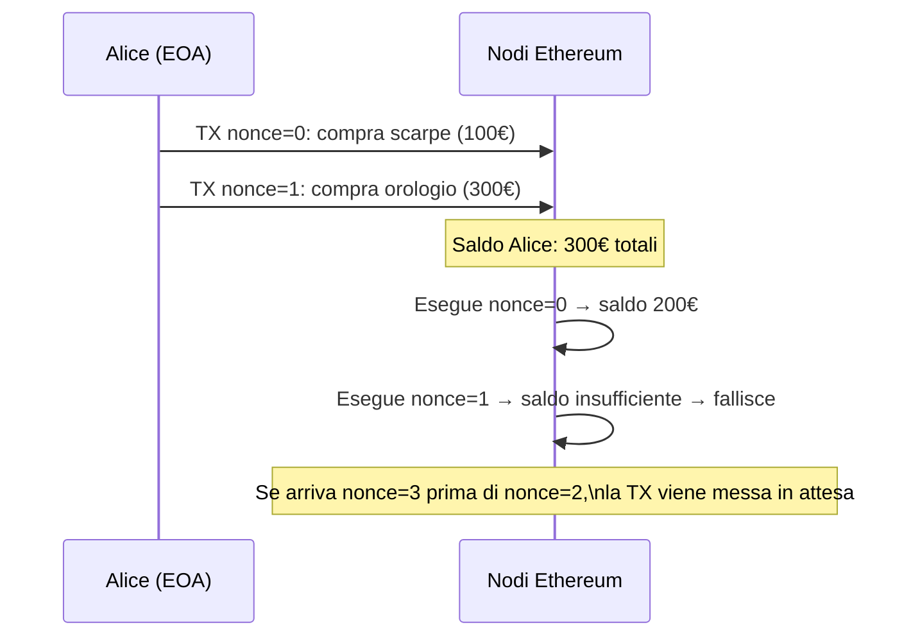

> Il [[nonce]] garantisce che tutte le transazioni provenienti da uno stesso EOA vengano eseguite **nell'ordine corretto**. Buchi nella sequenza bloccano le transazioni successive.

### 4.7 Deploy di uno Smart Contract

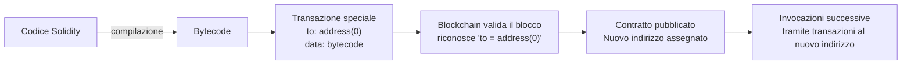

### 4.8 Oracoli

Gli smart contract possono agire **solo** su dati presenti sulla blockchain (tutti i nodi devono avere la stessa visione del mondo).

Per usare dati del mondo reale (es. esito di una partita, prezzo di un asset, condizioni meteo) servono gli **[[oracoli]]**:

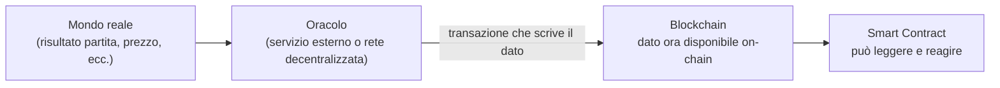

> Un oracolo può essere centralizzato (ci si fida di una fonte ufficiale) o decentralizzato (raggiunge il consenso tramite un proprio protocollo, es. Chainlink).

### 4.9 Timeline storica di Ethereum

| Anno | Evento |
|------|--------|
| 2013 | Vitalik Buterin propone Ethereum e gli smart contract |
| 2015 | Fork Ethereum / Ethereum Classic (causa: hack della DAO) |
| 2017 | Introduzione dei Layer 2 (es. Polygon/Matic) per scalabilità |
| 2022 | **The Merge:** passaggio da Proof of Work a **Proof of Stake** |

#### Il fork del 2015 — La DAO Hack

Una DAO (Decentralized Autonomous Organization) raccoglieva fondi tramite smart contract per finanziare progetti votati dalla community. Un bug nel contratto fu sfruttato per rubare milioni di ETH.

Il dilemma:
- **Gruppo A (→ Ethereum Classic):** l'immutabilità è sacra. Il bug era nel codice, non nel protocollo. Non si tocca la chain.
- **Gruppo B (→ Ethereum attuale):** situazione eccezionale. Si fa rollback della transazione malevola.

> Ethereum (attuale) ha mantenuto la filosofia di immutabilità nel protocollo, ma ha effettuato un **hard fork** per rimuovere quella specifica transazione. Ethereum Classic è rimasto con la chain originale (transazione presente).

---

## 5. Proof of Stake in Ethereum

### 5.1 Validatori e Stake

Nella [[proof-of-stake]], i nodi che propongono e validano i blocchi si chiamano **[[validatore|validatori]]**.

**Requisiti per diventare validatore:**
- **32 ETH** da depositare come **stake** (garanzia)
- Software: **Execution Client** (esegue transazioni/EVM) + **Consensus Client** (gestisce il consenso)

**Meccanismo di incentivi:**
- Comportamento corretto → **ricompensa** proporzionale allo stake
- Comportamento scorretto → **slashing** (perdita parziale o totale dello stake)

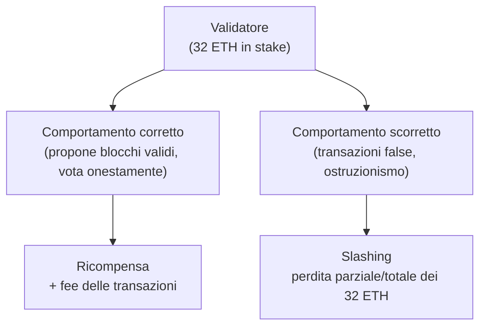

### 5.2 Slot ed Epoche

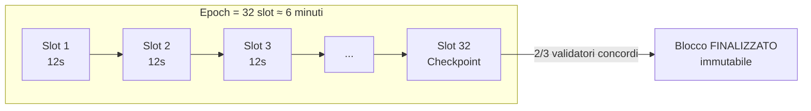

- **Slot:** ogni 12 secondi, un validatore estratto randomicamente propone un blocco
- **Epoch:** ogni 32 slot (~6 minuti), si vota per finalizzare i blocchi precedenti

### 5.3 Ciclo di vita di un blocco PoS

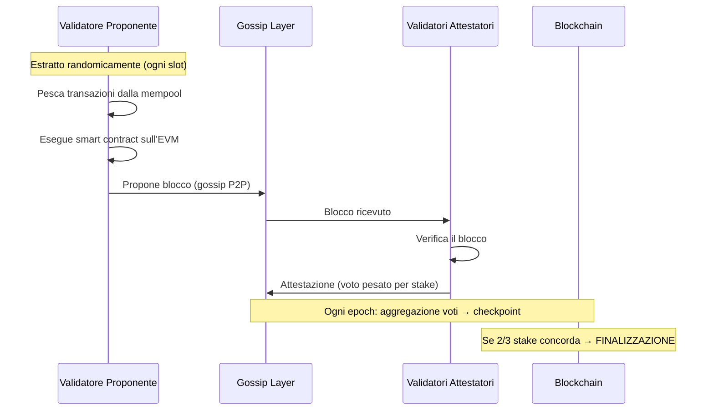

### 5.4 LMD Ghost — Risoluzione dei fork

**LMD Ghost** (Latest Message Driven Greediest Heaviest Observed SubTree): algoritmo per scegliere la catena principale in caso di fork.

- **Latest Message Driven:** se un validatore vota più volte per lo stesso branch, si prende solo il voto più recente
- **Ghost:** si sceglie il branch con il **peso maggiore** (somma degli stake dei validatori che lo supportano)

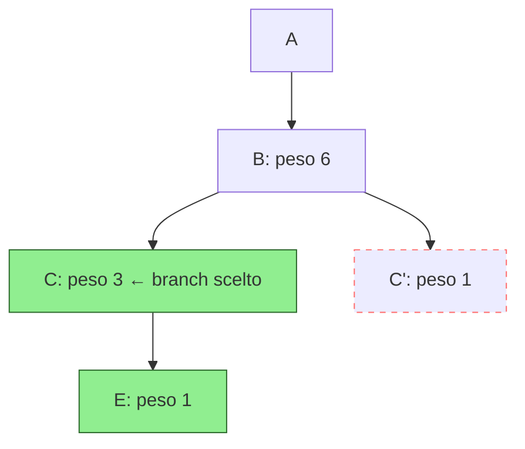

> Lo score di ogni branch = voto del blocco in quel branch + somma degli score di tutti i branch precedenti che portano a quel punto.

### 5.5 Casper FFG — Finalizzazione

**Casper FFG** finalizza i blocchi: una volta che **2/3 dei validatori** (per peso di stake) concordano su un checkpoint, tutto ciò che precede diventa **immutabile**.

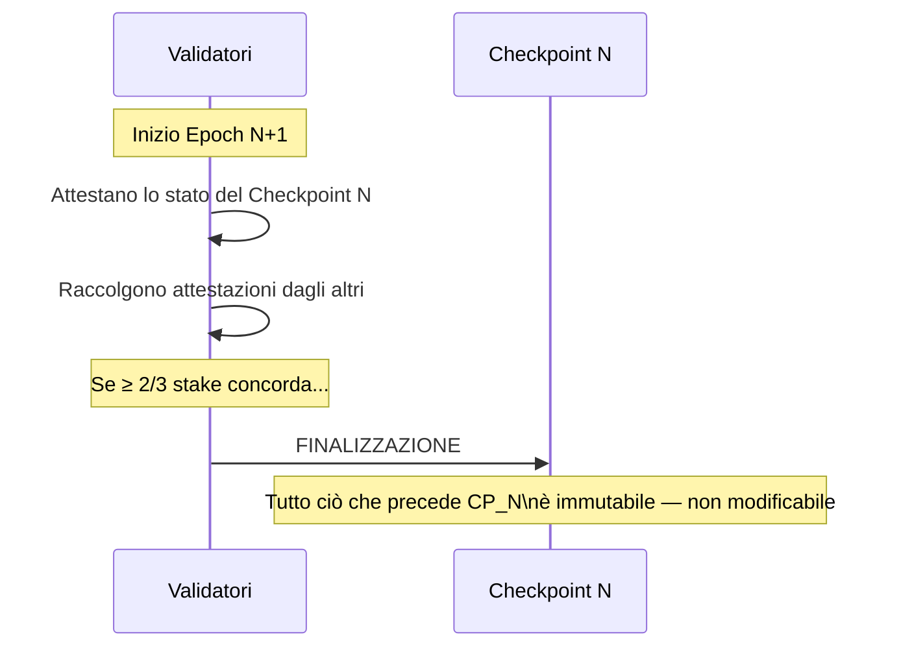

> La finalizzazione avviene ogni ~6 minuti (1 epoch), contro i ~60 minuti di Bitcoin.

### 5.6 Confronto PoW vs PoS

| Aspetto | Proof of Work (Bitcoin) | Proof of Stake (Ethereum) |
|---------|------------------------|--------------------------|
| **Chi produce blocchi** | Tutti i miner in competizione | Un validatore estratto a turno |
| **Incentivo onestà** | Costo energetico sprecato se si bara | Slashing dello stake |
| **Consumo energetico** | Altissimo (hardware specializzato) | Basso |
| **Soglia attacco 51%** | 51% dell'hashrate | 2/3 dello stake totale |
| **Frequenza fork** | Comune | Raro (un solo proponente per slot) |
| **Finalizzazione** | ~60 min | ~6 min |
| **Barriera ingresso** | Hardware ASIC + elettricità | 32 ETH (~100k€) + HW + SSD multi-TB |

> **Nota sulla decentralizzazione:** 32 ETH e la dimensione della blockchain (multi-TB su SSD) rendono l'accesso non banale. Simile al mining Bitcoin, che è diventato appannaggio di grandi mining farm.

### 5.7 Proprietà degli Smart Contract (riepilogo)

1. **Deploy = transazione** (pagamento fee obbligatorio)
2. **Ogni invocazione = transazione** (pagamento fee obbligatorio)
3. **Immutabilità:** il codice pubblicato non è modificabile
4. **Asincronia:** si invia la transazione e si aspetta che la rete la esegua → le DApp sono applicazioni asincrone
5. **Vincoli di gas:** operazioni complesse (loop, strutture dati grandi) possono superare il gas limit del blocco

---

## Appendice — Approfondimenti consigliati

> ⚠️ **Crittografia a curva ellittica (ECDSA):** il docente ha menzionato che Ethereum usa la firma digitale ECDSA, ma non è stata spiegata. È alla base della creazione e verifica delle firme. Approfondire: secp256k1, derivazione chiave pubblica da privata.

> ⚠️ **Layer 2 (Polygon, Optimism, Arbitrum):** menzionati come milestone del 2017 e come soluzione di scalabilità basata su **Zero Knowledge Proof**. Non spiegati nel dettaglio. Approfondire: rollup ottimistici vs ZK-rollup.

> ⚠️ **Zero Knowledge Proof:** citati come tecnologia alla base dei Layer 2. Tecnica crittografica che permette di dimostrare la validità di un'operazione senza rivelarne i dati. Non spiegata nel corso.

> ⚠️ **La DAO Hack (2016):** l'attacco tecnico non è stato spiegato (solo il contesto politico del fork). Si trattava di una vulnerabilità di **reentrancy** nello smart contract. Approfondire: reentrancy attack in Solidity.

> ⚠️ **Algoritmo di selezione del validatore proponente:** menzionato come "randomico" e "garantito dal protocollo open source". Non è stato spiegato il meccanismo (RANDAO + VDF). Approfondire per capire come si garantisce la casualità in un sistema deterministo.

> ⚠️ **Oracoli decentralizzati:** menzionati come soluzione per portare dati off-chain on-chain. Non è stata spiegata l'architettura di una rete oracolistica (es. Chainlink). Approfondire: come raggiunge il consenso su un dato esterno.

> ⚠️ **Diagramma fork LMD Ghost:** il docente ha spiegato l'algoritmo con riferimento a slide visuali non descritte verbalmente. La spiegazione dello score è parziale; verificare con il materiale su Moodle.
