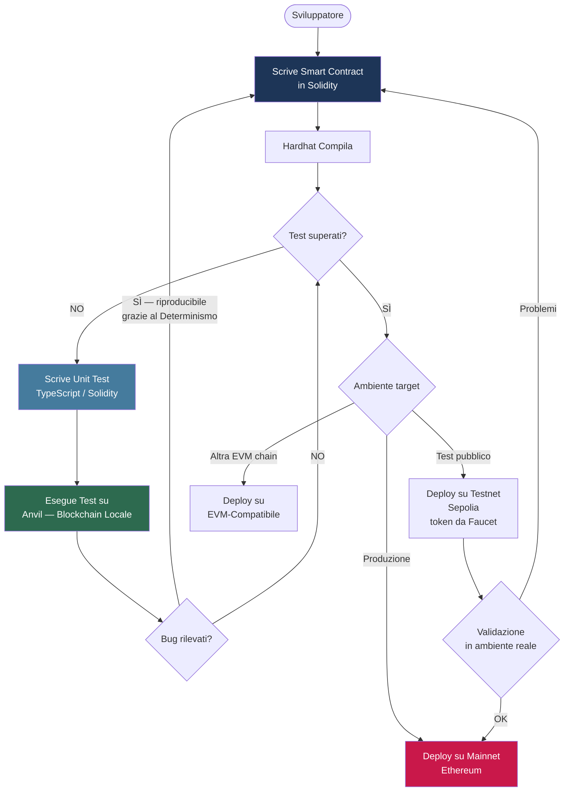
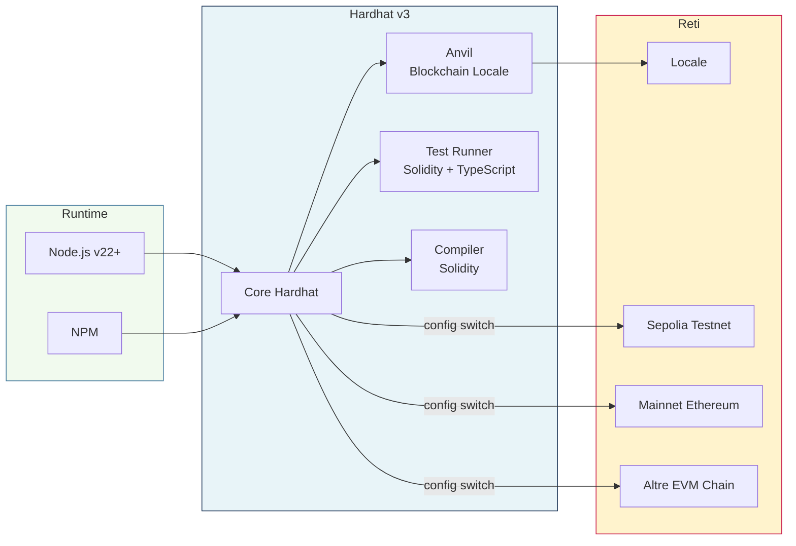

# Ethereum — Lezione 3
> **Lezione n.** 2 | **Data:** 2026-05-31

## Indice
- [[#1. Concetti Chiave]]
  - [[#Smart Contract]]
  - [[#Hardhat]]
  - [[#Anvil]]
  - [[#Determinismo della Blockchain Locale]]
  - [[#Faucet]]
  - [[#Testnet — Sepolia]]
  - [[#ESM (ECMAScript Modules)]]
  - [[#EVM-Compatibile]]
  - [[#Unit Test per Smart Contract]]
  - [[#Node.js e NPM]]
- [[#2. Formule e Procedure]]
  - [[#Procedura di Inizializzazione Progetto Hardhat]]
  - [[#Procedura di Cambio Rete]]
- [[#3. Relazioni tra Concetti]]
- [[#4. Diagrammi]]
  - [[#Workflow di Sviluppo Smart Contract]]
  - [[#Architettura dello Stack Tecnologico]]
- [[#5. Riepilogo Strutturato]]
- [[#Appendice — Approfondimenti Consigliati]]

---

## 1. Concetti Chiave

### [[Smart Contract]]
Programma distribuito su blockchain con proprietà di **immutabilità post-deploy**: una volta pubblicato, il codice non può essere modificato. È possibile pubblicare versioni successive, ma le precedenti rimangono attive e accessibili sulla rete.

> **Implicazione critica**: l'immutabilità rende la fase di testing non opzionale ma strutturalmente necessaria prima del deploy.

---

### [[Hardhat]]
Framework open-source per lo sviluppo di [[Smart Contract]] in [[Solidity]]. Fornisce un ambiente integrato per:
- Compilazione del codice [[Solidity]]
- Deploy su reti reali o locali
- Testing automatizzato ([[Unit Test]])

Attualmente alla **versione 3**, con breaking changes rispetto alla v2.

---

### [[Anvil]]
Componente di simulazione blockchain locale incluso nello stack di sviluppo (parte del toolkit [[Foundry]], integrato con [[Hardhat]]). Caratteristiche principali:

| Proprietà | Descrizione |
|---|---|
| **[[Determinismo]]** | Ogni esecuzione produce gli stessi risultati dati gli stessi input |
| **Locale** | Nessuna connessione a rete esterna richiesta |
| **Indirizzi pre-finanziati** | Fornisce wallet con token di test al bootstrap |
| **Multi-rete** | Configurabile per simulare mainnet, testnet o rete custom |

---

### [[Determinismo]] della Blockchain Locale
Proprietà per cui, dati gli stessi input e lo stesso stato iniziale, l'esecuzione produce invariabilmente lo stesso output. Essenziale per:
- **Riproducibilità degli errori** (*bug reproduction*)
- **Verifica della correzione** (*regression testing*)

---

### [[Faucet]]
Servizio web che distribuisce token di test (privi di valore economico reale) su reti blockchain di test ([[Testnet]]). Le faucet moderne impongono restrizioni crescenti (es. possesso di token reali) per prevenire abusi e traffico artificiale.

> **Nota**: Alchemy è propriamente un **RPC provider** con una faucet associata, non una faucet pura — la distinzione è marginale a questo livello ma vale la pena tenerla presente.

---

### [[Testnet]] — Sepolia
Rete blockchain pubblica parallela alla mainnet Ethereum, utilizzata per test pre-produzione. Richiede token di test ottenibili via [[Faucet]]. Alternativa alla blockchain locale quando si vuole testare in un ambiente distribuito reale.

---

### [[ESM]] (ECMAScript Modules)
Standard moderno di modularizzazione JavaScript basato su `import`/`export` espliciti, in contrapposizione al sistema [[CommonJS]] (`require`). [[Hardhat]] v3 adotta un approccio **ESM-first**.

```javascript
// ESM — standard Hardhat v3
import { ethers } from "hardhat";
export default async function deploy() { ... }

// CommonJS — approccio legacy
const { ethers } = require("hardhat");
module.exports = async function deploy() { ... }
```

---

### [[EVM-Compatibile]]
Qualifica una blockchain che implementa l'[[Ethereum Virtual Machine]] come ambiente di esecuzione. Contratti scritti in [[Solidity]] sono deployabili su qualsiasi rete [[EVM-Compatibile]] (es. Polygon, Avalanche C-Chain, BNB Chain) senza modifiche al codice sorgente.

---

### [[Unit Test]] per Smart Contract
Tecnica di verifica del comportamento atteso di singole funzioni o moduli del contratto in isolamento. In [[Hardhat]] v3 supportata in **due modalità non mutuamente esclusive**:

| Modalità | Linguaggio | Tool / Libreria |
|---|---|---|
| Legacy | TypeScript | Mocha |
| Nuova (v3) | [[Solidity]] | Hardhat Test Runner nativo |

> Le due modalità coesistono e, secondo quanto anticipato a lezione, saranno entrambe necessarie nel corso del progetto. La distinzione funzionale tra le due non è stata ancora chiarita — vedi [[#Appendice — Approfondimenti Consigliati]].

---

### [[Node.js]] e [[NPM]]
- **[[Node.js]]**: runtime JavaScript server-side, base dell'ecosistema [[Hardhat]]. Versione minima richiesta: **22+**
- **[[NPM]]** (Node Package Manager): gestore di dipendenze utilizzato per installare e gestire i pacchetti del progetto [[Hardhat]]

---

## 2. Formule e Procedure

### Procedura di Inizializzazione Progetto Hardhat

```bash
# Step 1: creare una directory vuota
mkdir my-hardhat-project
cd my-hardhat-project

# Step 2: inizializzare il progetto con wizard interattivo
npx hardhat --init
```

> **Nota**: `npx` esegue il binario di [[Hardhat]] senza installazione globale preliminare, scaricando temporaneamente il pacchetto da [[NPM]].
> Il wizard pone una serie di domande interattive (tipo di progetto, linguaggio, plugin opzionali) — i dettagli delle scelte consigliate non sono stati documentati a lezione.

---

### Procedura di Cambio Rete

La transizione tra ambienti avviene modificando un **singolo file di configurazione** (`hardhat.config.ts` o equivalente), senza alterare il codice del contratto né quello dei test:

```
Blockchain locale (Anvil)
        ↓  [modifica hardhat.config.ts]
Testnet pubblica (Sepolia)
        ↓  [modifica hardhat.config.ts]
Mainnet Ethereum
```

> La struttura interna del file di configurazione non è stata mostrata a lezione — vedi [[#Appendice — Approfondimenti Consigliati]].

---

## 3. Relazioni tra Concetti

```
[[Hardhat]] ──usa──────────► [[Node.js]] / [[NPM]]
[[Hardhat]] ──include──────► [[Anvil]]
[[Hardhat]] ──compila──────► [[Smart Contract]] in [[Solidity]]
[[Hardhat]] ──supporta─────► [[Unit Test]] (TypeScript + Solidity)
[[Hardhat]] ──supporta─────► [[ESM]]
[[Hardhat]] ──deploy su────► [[Anvil]] | [[Testnet]] | Mainnet

[[Anvil]] ──implementa─────► [[Determinismo]]
[[Anvil]] ──simula──────────► Blockchain locale

[[Smart Contract]] ──immutabilità──► necessita [[Unit Test]]
[[Smart Contract]] in [[Solidity]] ──portabile su──► [[EVM-Compatibile]]

[[Testnet]] ──richiede token da──► [[Faucet]]
[[Faucet]] ──restrizioni anti-abuso──► motivazione per [[Anvil]]
```

---

## 4. Diagrammi

### Workflow di Sviluppo Smart Contract



---

### Architettura dello Stack Tecnologico



---

## 5. Riepilogo Strutturato

| Elemento | Dettaglio |
|---|---|
| **Tool principale** | [[Hardhat]] v3 |
| **Versione [[Node.js]]** | ≥ 22 |
| **Blockchain locale** | [[Anvil]] (deterministica, pre-finanziata) |
| **Testing** | TypeScript (Mocha) + [[Solidity]] nativo |
| **Paradigma JS** | [[ESM]]-first |
| **Comando init** | `npx hardhat --init` |
| **Portabilità** | Qualsiasi rete [[EVM-Compatibile]] |
| **Motivazione principale** | Immutabilità [[Smart Contract]] → testing obbligatorio |

---

## Appendice — Approfondimenti Consigliati

> ⚠️ **Identità di Anvil nel contesto Hardhat**: [[Anvil]] è il componente di simulazione locale del toolkit [[Foundry]], un ecosistema separato da [[Hardhat]]. Non è stato chiarito a lezione se viene usato come tool autonomo, tramite plugin, o se il docente usa "Anvil" come termine generico per la [[Hardhat]] Network nativa. L'ambiguità tecnica rimane aperta — verificare nella documentazione ufficiale di Hardhat v3.

> ⚠️ **Contesto della lezione precedente (Remix)**: nella lezione precedente si è tentato di lavorare con [[Remix IDE]] con esito problematico (causa non documentata — versione? faucet?). Mancano le note di quella sessione. Recuperare il materiale per comprendere la relazione tra [[Remix]] e lo stack [[Hardhat]] introdotto in questa lezione.

> ⚠️ **Struttura del file di configurazione**: il cambio di rete avviene tramite `hardhat.config.ts`, ma la struttura del file non è stata mostrata. Consultare la documentazione ufficiale di Hardhat v3 per un esempio di configurazione multi-rete.

> ⚠️ **Differenza funzionale tra test in Solidity e test in TypeScript**: è stato affermato che entrambe le modalità di [[Unit Test]] saranno necessarie, ma non è stato spiegato cosa ciascuna testa che l'altra non può. Approfondire prima della sessione pratica: in generale i test TypeScript permettono di simulare interazioni esterne e scenari di integrazione, mentre i test Solidity nativi sono più adatti alla verifica di logica interna a basso livello.

> ⚠️ **Opzioni del wizard `npx hardhat --init`**: il wizard interattivo di inizializzazione pone domande su tipo di progetto, linguaggio (TypeScript/JavaScript) e plugin opzionali. Le scelte raccomandate per questo corso non sono state documentate. Chiarire nella prossima lezione o consultare la guida ufficiale di Hardhat v3.