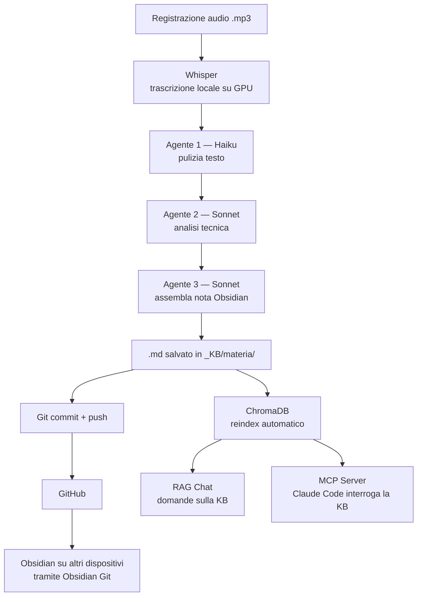

# Shared KB with LLM


Knowledge base universitaria personale, generata automaticamente da registrazioni audio e interrogabile in linguaggio naturale tramite LLM. Le note non vengono scritte a mano: vengono prodotte da una pipeline agentica che parte dall'audio della lezione e restituisce Markdown strutturato per Obsidian.

---

## Come funziona



### Pipeline agentica

Le registrazioni vengono caricate in un'interfaccia web locale. La trascrizione avviene localmente con `whisper-ctranslate2` (GPU, `int8_float16`). Dopodiché tre agenti Claude lavorano in sequenza:

| Agente | Modello | Compito |
|--------|---------|---------|
| Pulizia | Haiku | Rimuove filler, ripetizioni e auto-correzioni. Non parafrasa mai i contenuti tecnici. |
| Analisi | Sonnet | Estrae definizioni, formule LaTeX, pseudocodice, wikilink `[[concetto]]`, diagrammi Mermaid. Identifica i salti logici e i riferimenti a materiale non incluso nell'audio. |
| Sintesi | Sonnet | Assembla la nota finale con frontmatter YAML, indice interno, sezioni strutturate e appendice dei gap concettuali. |

L'output è un file `.md` pronto per Obsidian, con tutto il contenuto della lezione e zero lavoro manuale.

---

## Struttura della KB

```
_KB/
  NomeMateria/
    _index.md          ← indice auto-generato per materia
    01_argomento.md
    02_altro-argomento.md
  _glossario.md        ← termini trasversali
  search.py            ← ricerca semantica CLI
  kb_mcp.py            ← MCP server per Claude Code
  kb_sync.sh           ← sync automatico git + reindex
  .chromadb/           ← indice vettoriale locale (non committato)
  .venv/               ← dipendenze Python (non committato)
```

---

## Ricerca semantica e RAG

Le note vengono indicizzate in ChromaDB con embeddings multilingua (`paraphrase-multilingual-MiniLM-L12-v2`, ~120MB, gira in locale). Questo abilita due modalità di interrogazione:

**Chat RAG** — tramite l'interfaccia web, Claude risponde a domande usando esclusivamente il contenuto delle note come contesto. Se l'informazione non è nella KB, lo dice esplicitamente.

**Ricerca CLI** — direttamente da terminale:
```bash
.venv/bin/python search.py "consensus algorithm proof of stake"
.venv/bin/python search.py index   # reindicizza dopo nuove note
```

---

## MCP Server — KB dentro Claude Code

`kb_mcp.py` espone la knowledge base come tool MCP. Una volta registrato in Claude Code, il modello può interrogare automaticamente le note ogni volta che l'utente fa una domanda su argomenti del corso — senza dover copiare contesto a mano.

```json
{
  "mcpServers": {
    "kb-universitaria": {
      "command": "/path/to/_KB/.venv/bin/python",
      "args": ["/path/to/_KB/kb_mcp.py"]
    }
  }
}
```

---

## Sincronizzazione tra dispositivi

La KB vive su più macchine in modo trasparente tramite due layer:

**Git + Obsidian Git** — il repo GitHub è il punto di verità. `kb_sync.sh` fa pull, commit automatico delle note nuove, push e reindex in un singolo comando. Su altri dispositivi, il plugin [Obsidian Git](https://github.com/denolehov/obsidian-git) mantiene tutto aggiornato.

**Syncthing** — per la sincronizzazione in tempo reale tra macchine locali sulla stessa rete (o via Tailscale), Syncthing propaga le modifiche senza passare da GitHub.

---

## Stack

- `whisper-ctranslate2` — trascrizione audio locale
- `anthropic` — pipeline agentica (Haiku + Sonnet)
- `chromadb` + `sentence-transformers` — ricerca semantica locale
- `mcp` — server MCP per l'integrazione con Claude Code
- Obsidian — visualizzazione e navigazione delle note
- Git / Syncthing / Tailscale — sincronizzazione multi-dispositivo
